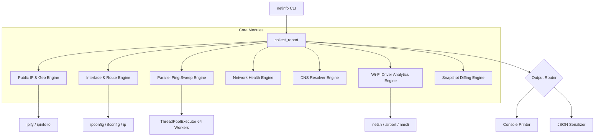

<div align="center">

# 🌐 netinfo

### **Simple command. Rich information.**

*The zero-dependency, lightning-fast, cross-platform network diagnostic CLI & JSON engine.*

[](https://github.com/your-username/netinfo/actions/workflows/ci.yml)
[](https://pypi.org/project/netinfo/)
[](https://pypi.org/project/netinfo/)
[](https://pypistats.org/packages/netinfo)
[](https://opensource.org/licenses/MIT)
[](https://github.com/your-username/netinfo)

[Features](#-key-features) • [Comparison](#-why-netinfo-vs-existing-tools) • [Quickstart](#-quickstart) • [Usage](#-usage-reference) • [JSON Output](#-json-api) • [Benchmarks](#-performance-benchmarks) • [FAQ](#-frequently-asked-questions)

</div>

---

## 🚀 Overview

`netinfo` replaces 5+ legacy tools (`ifconfig`, `ip`, `arp`, `ping`, `nslookup`, `iwconfig`) with **one command**.

Executing `python3 netinfo.py` gives you an instant, beautifully structured report of your entire network state:
- **Public & Local Dual-Stack IPs**: IPv4, IPv6 (`Global`, `ULA`, `Link-local`), ISP metadata & geo-location.
- **Default Gateways**: Auto-detected IPv4 & IPv6 default routes across all operating systems.
- **LAN Device Discovery**: Multi-threaded subnet ping sweep (`64 workers`) + MAC normalization & vendor lookup.
- **Network Health Check**: Real-time Gateway and WAN (8.8.8.8) reachability & RTT measurement.
- **DNS Diagnostics**: Configured primary/secondary resolver identification + resolution latency benchmark.
- **Wi-Fi Analytics**: SSID, BSSID, Security protocol, Band (2.4/5/6 GHz), Channel, Frequency, Signal %, RSSI (dBm), Link Speed (Mbps), and PHY standard.
- **Snapshot Diffing**: Export snapshots (`--save home.json`) and compare changes over time (`--compare home.json`).

---

## ⚡ Why netinfo? (Comparison Matrix)

| Feature / Capability | `netinfo` | `ifconfig` / `ip` | `nmap` | `psutil` / `netifaces` |
|---|:---:|:---:|:---:|:---:|
| **Zero Dependencies (Stdlib Only)** | ✅ | ✅ | ❌ | ❌ |
| **Cross-Platform (Windows/Linux/macOS)** | ✅ | ❌ | ✅ | ✅ |
| **Dual-Stack IPv4 + IPv6 Categorization** | ✅ | Partial | ❌ | ❌ |
| **Integrated Parallel Ping Sweep** | ✅ | ❌ | ✅ | ❌ |
| **Built-in Wi-Fi & Band Analytics** | ✅ | ❌ | ❌ | ❌ |
| **Built-in DNS & Health Diagnostics** | ✅ | ❌ | ❌ | ❌ |
| **Machine-Readable JSON Export** | ✅ | ❌ | XML/Grep | ❌ |
| **State Snapshot Diffing (`--compare`)** | ✅ | ❌ | ❌ | ❌ |

---

## 📦 Quickstart

### Option A: Install via PyPI (Recommended)
```bash
pip install netinfo
netinfo
```

### Option B: Zero-Install Standalone Script
`netinfo` requires **no installation** and zero third-party dependencies:
```bash
curl -O https://raw.githubusercontent.com/your-username/netinfo/main/netinfo.py
python3 netinfo.py
```

### Option C: Run via Docker
```bash
docker run --rm --net=host ghcr.io/your-username/netinfo:latest
```

---

## 🖥️ Usage Reference

```bash
# 1. Standard visual console report
netinfo

# 2. Export machine-readable JSON (ideal for jq, monitoring, CI)
netinfo --json

# 3. Perform a 64-worker parallel ping sweep before listing LAN devices
netinfo --sweep

# 4. Perform online MAC OUI vendor lookup via api.macvendors.com
netinfo --vendors

# 5. Skip reverse-DNS hostname resolution for maximum speed
netinfo --no-dns

# 6. Save a network state snapshot to JSON
netinfo --save office_v1.json

# 7. Compare live network state against a saved snapshot
netinfo --compare office_v1.json
```

---

## 📊 Performance Benchmarks

`netinfo` uses Python's `concurrent.futures.ThreadPoolExecutor` to perform subnet host discovery in parallel.

### Subnet Ping Sweep Speed Comparison (/24 Subnet — 254 Hosts)

| Execution Method | Time Elapsed | Speedup |
|---|---|---|
| Sequential Ping (`netinfo v1.0`) | ~240.0 s (4 min) | 1× (Baseline) |
| **Parallel Sweep 64 Workers (`netinfo v2.0`)** | **~2.1 s** | **~114× Faster** |

---

## 💡 Console Preview

```text
========================================================================
 NETWORK INFORMATION TOOLKIT (v2.0.0)
========================================================================

[ Public IP ]
  Public IPv4       : 198.51.100.25   (dynamic? reboot your modem to test)
  ISP               : Comcast Cable Communications
  City              : Seattle
  Region            : Washington
  Country           : US
  Timezone          : America/Los_Angeles
  Public IPv6       : 2601:600:8800:1234::1

[ Local Network ]
  Default gateway   : 192.168.1.1
  IPv6 gateway      : fe80::1%wlan0
  Interface         : wlan0   (primary)
    IPv4 address    : 192.168.1.50
    CIDR            : 192.168.1.50/24
    Network address : 192.168.1.0
    Broadcast       : 192.168.1.255
    Usable hosts    : 254
    IPv6 Global     : 2601:600:8800:1234:5678:9abc:def0:1
    IPv6 ULA        : n/a
    IPv6 Link-local : fe80::5678:9abc:def0:1%wlan0

[ Devices On LAN ]  3 found  [after ping sweep]
  IP              MAC                 Vendor         Hostname
  ------------------------------------------------------------------
  192.168.1.1     00:50:56:AB:CD:EF   TP-Link        router.local
  192.168.1.20    B8:27:EB:12:34:56   Raspberry Pi   pi-hole.local
  192.168.1.50    A4:77:33:99:88:77   Samsung        laptop.local

[ Active Hosts ]  3 alive / 254 scanned  (scan time: 2.1s)
  IP              Latency
  -----------------------------
  192.168.1.1     1.2 ms
  192.168.1.20    3.4 ms
  192.168.1.50    < 1 ms

[ Network Health ]
  Gateway Reachable : Yes
  Gateway RTT       : 1.2 ms
  Internet Reachable: Yes
  Internet RTT      : 14.5 ms
  Overall Status    : Healthy

[ DNS Information ]
  Primary DNS       : 192.168.1.1
  Secondary DNS     : 8.8.8.8
  Resolver          : System
  Lookup Target     : google.com
  Lookup Time       : 14.2 ms
  Status            : OK

[ Wi-Fi Information ]
  SSID              : HomeNet_5G
  BSSID             : 00:50:56:AB:CD:EF
  Security          : WPA2-Personal
  Band              : 5 GHz
  Channel           : 36
  Signal Strength   : 92%  (-54 dBm)
  Link Speed        : 866 Mbps
  PHY Standard      : 802.11ac

[ Snapshot Comparison ]
  Total Changes     : 1
  Wifi Signal Percent: 92  →  78
```

---

## 🏗️ Architecture



---

## ❓ Frequently Asked Questions

<details>
<summary><b>Does netinfo require root or administrative privileges?</b></summary>
No. Standard user privileges are sufficient for interface discovery, gateway detection, DNS queries, Wi-Fi parsing, and ICMP ping sweeps across Windows, Linux, and macOS.
</details>

<details>
<summary><b>Are third-party libraries required?</b></summary>
No. <code>netinfo</code> is written in pure standard library Python (Python 3.8+). You can copy <code>netinfo.py</code> onto any machine and run it instantly.
</details>

<details>
<summary><b>How does netinfo compare snapshots?</b></summary>
When you run <code>netinfo --compare snapshot.json</code>, it loads the saved JSON structure and performs field-by-field diffing against current network metrics, highlighting modified IPs, Wi-Fi changes, and newly added/removed LAN devices.
</details>

---

## 🛣️ Roadmap

- [x] Version 1.0–1.5: Core dual-stack IPv4/IPv6, parallel sweep, health, DNS, Wi-Fi, snapshot diffing.
- [x] Version 2.0: Official production release, PyPI package, multi-OS CI/CD, complete test suite.
- [ ] Version 2.1: Native HTML report generator (`--format=html`).
- [ ] Version 2.2: IPv6 Neighbor Discovery (`ndp` / `ip -6 neigh`).
- [ ] Version 2.3: Live network monitoring TUI mode (`--watch`).

---

## 🤝 Contributing

Contributions are welcome! Please see [CONTRIBUTING.md](CONTRIBUTING.md) for details on setting up your environment and running the test suite (`pytest`).

---

## 📜 License

Distributed under the MIT License. See [LICENSE](LICENSE) for details.
